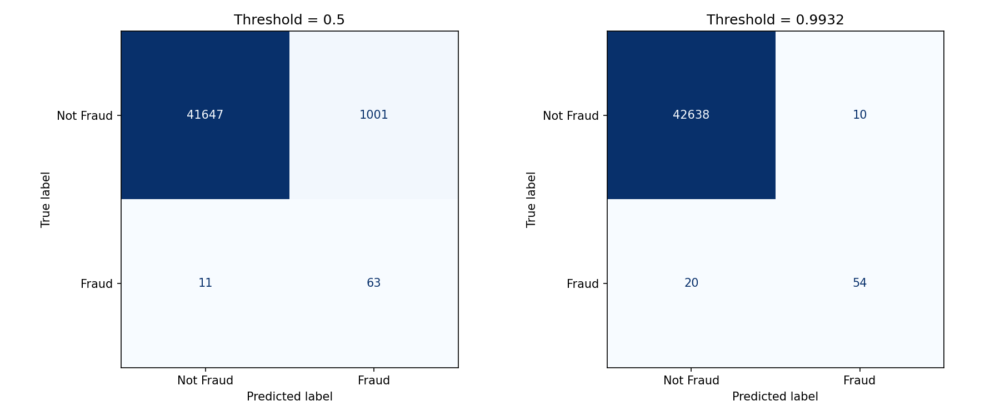
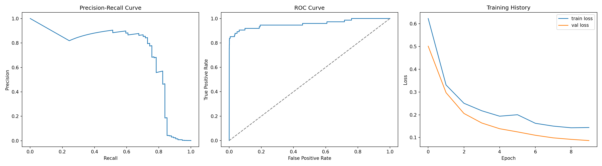

<div align="center">

# 💳 Credit Card Fraud Detection

**A deep learning (MLP) system that detects fraudulent credit card transactions on a highly imbalanced dataset.**


</div>

---

## 📌 Overview

Credit card fraud is rare but costly. In this dataset, fraudulent transactions make up only a tiny fraction of all records, so a model that simply predicts "not fraud" would look accurate while catching nothing.

This project builds a **Multi-Layer Perceptron (MLP)** in TensorFlow/Keras that handles the class imbalance with class weighting, evaluates with metrics that suit imbalanced data (**PR-AUC, recall, precision**), and tunes the decision threshold to balance missed fraud against falsely blocked customers.

## ✨ Key Features

- **Data preprocessing:** `Amount` and `Time` are standardized; V1–V28 are already PCA components.
- **Stratified train/validation/test split (70/15/15):** keeps the same fraud ratio in every split.
- **Class-imbalance handling:** balanced class weights during training (SMOTE is included as a commented alternative).
- **Regularized MLP:** Batch Normalization and Dropout reduce overfitting.
- **Smart training:** early stopping on validation PR-AUC and learning-rate reduction on plateau.
- **Threshold tuning:** picks the decision threshold that maximizes F1 instead of using the default 0.5.
- **Rich evaluation:** confusion matrices, Precision-Recall curve, ROC curve, and training history.

## 🧠 Model Architecture

| Layer | Details |
|-------|---------|
| Input | 30 features |
| Dense + ReLU | 64 units → BatchNorm → Dropout (0.3) |
| Dense + ReLU | 32 units → BatchNorm → Dropout (0.3) |
| Dense + ReLU | 16 units → Dropout (0.2) |
| Output | 1 unit, Sigmoid (probability of fraud) |

- **Optimizer:** Adam (learning rate 1e-3)
- **Loss:** Binary cross-entropy
- **Batch size:** 2048, up to 60 epochs
- **Tracked metrics:** Precision, Recall, ROC-AUC, PR-AUC

## 📊 Results

| Metric | Score |
|--------|-------|
| ROC-AUC | `XX.XX` |
| PR-AUC | `XX.XX` |
| Precision (fraud, tuned threshold) | `XX.XX` |
| Recall (fraud, tuned threshold) | `XX.XX` |
| F1-score (fraud, tuned threshold) | `XX.XX` |

> Replace the `XX.XX` values with the numbers printed when you run `project.py`.

### Confusion Matrices

<p align="center">
  
</p>

*Left: default threshold (0.5). Right: threshold tuned for best F1.*

### Evaluation Curves

<p align="center">
  
</p>

## 📂 Project Structure

```
Credit-Card-Fraud-Detection-
├── project.py                      # Full pipeline: preprocessing, training, evaluation
├── fraud_detection_mlp.keras       # Trained model
├── confusion_matrix_default.png    # Confusion matrix at threshold 0.5
├── confusion_matrix_best.png       # Confusion matrix at best-F1 threshold
├── confusion_matrix_comparison.png # Side-by-side comparison
├── fraud_detection_results.png     # PR curve, ROC curve, training history
└── README.md
```

## 🚀 Getting Started

### 1. Clone the repository

```bash
git clone https://github.com/Pardhu-Maddu/Credit-Card-Fraud-Detection-.git
cd Credit-Card-Fraud-Detection-
```

### 2. Install dependencies

```bash
pip install pandas numpy scikit-learn tensorflow imbalanced-learn matplotlib
```

### 3. Download the dataset

Download `creditcard.csv` from the
[Kaggle Credit Card Fraud Detection dataset](https://www.kaggle.com/datasets/mlg-ulb/creditcardfraud)
and place it in the project folder. The file is large, so it is not included in this repository.

### 4. Run the project

```bash
python project.py
```

This trains the model, prints the evaluation metrics, saves the plots, and writes `fraud_detection_mlp.keras`.

### Use the saved model

```python
from tensorflow import keras

model = keras.models.load_model("fraud_detection_mlp.keras")
fraud_probability = model.predict(X_new)  # X_new must be scaled the same way as training data
```

## 🔍 Why These Choices?

- **PR-AUC over accuracy:** with so few fraud cases, accuracy is misleading. PR-AUC reflects how well the model finds the rare class.
- **Threshold tuning:** a missed fraud and a wrongly blocked customer have different costs, so the threshold should be chosen deliberately.
- **Class weights:** penalizing fraud mistakes more heavily teaches the model to pay attention to the minority class.

## 🔮 Future Improvements

- Compare against Random Forest, XGBoost, and Logistic Regression baselines
- Try SMOTE / under-sampling and compare with class weighting
- Add k-fold cross-validation
- Wrap the model in a Flask/FastAPI service or a Streamlit demo
- Add model explainability with SHAP

## 🙋 Author

**Pardhu Maddu**: Python Developer and AI/ML Enthusiast

[](https://github.com/Pardhu-Maddu)
[](https://www.linkedin.com/in/YOUR-LINKEDIN-ID)

---

<div align="center">⭐ If you found this project useful, consider giving it a star!</div>
